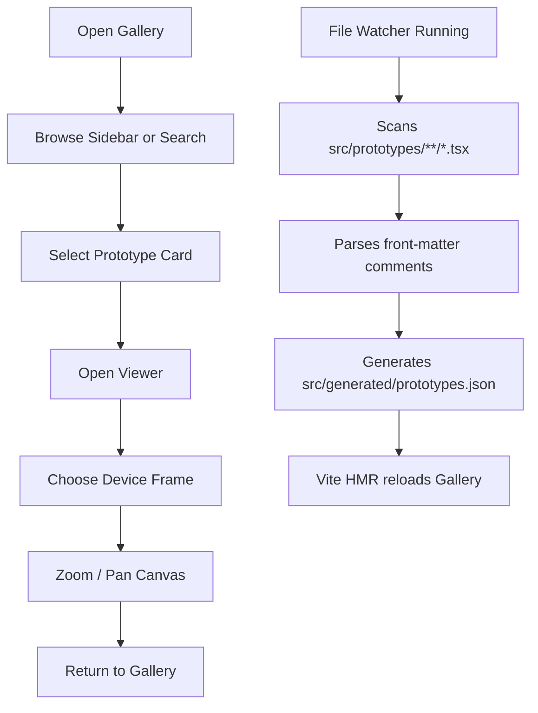

# PRD — UI Prototype Gallery

## 1. Product Overview

A static UI Prototype Gallery that lets designers and engineers browse complete application screens (not isolated components) the way Storybook is used for components and Figma Community is used for static designs.

- Not a component library, not a flow editor, not an AI tool — just a visual library of full screens.
- Each prototype is a single React component, completely static.
- The application itself behaves like a developer tool: fast, clean, modern, keyboard-friendly.

## 2. Core Features

### 2.1 Feature Module

1. **Gallery Page (`/`)**: responsive grid of prototype cards (thumbnail + title + category + device).
2. **Viewer Page (`/prototype/:id`)**: large canvas with the prototype inside a device frame, plus zoom controls (fit / 100% / +/-).
3. **Sidebar Navigation**: collapsible tree grouped by device → category → prototype, inspired by Storybook.
4. **Search**: client-side fuzzy search across title, category, tags.
5. **Theme Switching**: light / dark theme with system preference detection.
6. **Automatic Prototype Registry**: a Node file watcher generates `src/generated/prototypes.json` from `src/prototypes/**/*.tsx`. Front-matter comments override defaults.

### 2.2 Page Details

| Page | Module | Feature Description |
|------|--------|---------------------|
| Gallery | Header | Brand, global search bar, theme toggle |
| Gallery | Sidebar | Tree navigation: device → category → prototype |
| Gallery | Card Grid | Responsive (1–4 cols), each card = thumbnail preview + title + category + device badge + tags |
| Viewer | Toolbar | Back to gallery, fit / 100% / zoom-in / zoom-out, background toggle (checker / solid / transparent) |
| Viewer | Canvas | Centered prototype inside a device frame (iPhone / Android / Tablet / Desktop) with pan + zoom |
| Viewer | Meta Panel | Title, tags, source path |
| Theme | Toggle | Light / Dark |

## 3. Core Process

## 4. User Interface Design

### 4.1 Design Style

- **Tone**: refined minimal, inspired by Linear / Vercel / Raycast / Storybook.
- **Color**: zinc neutrals with a single violet accent (`#7c5cff` family). Soft surface fills, never pure white/black.
- **Buttons**: rounded `lg`, subtle hover lift, no gradients on primary buttons.
- **Typography**: display = `Geist`, body = `Inter Tight`, monospace = `JetBrains Mono`.
- **Spacing rhythm**: 4 / 8 / 12 / 16 / 24 / 32 / 48 px.
- **Surfaces**: `bg-background`, layered with `bg-card` and elevated cards with `shadow-[0_1px_2px_rgba(0,0,0,0.04),0_8px_24px_-12px_rgba(0,0,0,0.08)]`.
- **No skeuomorphism, no purple-gradient-on-white clichés.**

### 4.2 Page Design Overview

| Page | Module | UI Elements |
|------|--------|-------------|
| Gallery | Header | 56 px sticky top bar, brand wordmark, centered search, theme toggle button |
| Gallery | Sidebar | 280 px collapsible, scrollable tree, active item uses accent background |
| Gallery | Card | 16:10 cover area with device-sized frame preview, padding, tags as chips |
| Viewer | Toolbar | Bottom-right floating toolbar with icon buttons, glass background |
| Viewer | Canvas | Dotted-grid background, prototype framed inside iPhone/Android/Tablet/Desktop mockup |

### 4.3 Responsiveness

- Desktop-first.
- Sidebar collapses into a slide-in drawer below 1024 px.
- Gallery grid: 4 cols ≥ 1280 px, 3 cols ≥ 1024 px, 2 cols ≥ 640 px, 1 col < 640 px.
- Viewer keeps the canvas centered with min 320 px width.

## 5. Non-Goals

No AI generation, no export, no drag-and-drop, no infinite canvas, no flow connectors, no state management library for app state, no backend, no auth, no database. These are future milestones.
