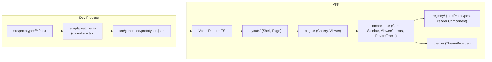

# Technical Architecture — UI Prototype Gallery

## 1. Architecture Design



The app is a single Vite SPA. The watcher is a Node side process started at `npm run dev` (or as a separate `npm run watch` script) that regenerates `src/generated/prototypes.json` whenever a prototype file changes. Vite picks up the JSON change through HMR.

## 2. Technology Description

- **Frontend**: React 18 + TypeScript + Vite 5
- **Styling**: Tailwind CSS 3 + tailwindcss-animate + CSS variables for theme tokens
- **UI primitives**: shadcn-style small primitives (Button, Input, Tooltip) built locally (no CLI) — avoids extra deps
- **Routing**: React Router 6 (`/` and `/prototype/:id`)
- **App state**: Zustand for `useThemeStore` (light/dark + sidebar collapsed)
- **Zoom / Pan**: `react-zoom-pan-pinch`
- **Icons**: `lucide-react`
- **File watcher**: `chokidar` + `tsx`
- **Front-matter parsing**: hand-rolled regex (no extra dep)
- **Fonts**: Geist + Inter Tight + JetBrains Mono via `@fontsource`

No backend, no API, no auth, no database.

## 3. Route Definitions

| Route | Purpose |
|-------|---------|
| `/` | Gallery page: search + sidebar + grid |
| `/prototype/:id` | Viewer page: device-framed prototype canvas |

## 4. Data Model

### 4.1 Prototype Metadata Definition

```ts
type Device = 'mobile' | 'desktop' | 'tablet';

interface PrototypeMeta {
  id: string;          // "mobile-auth-login"
  title: string;       // "Login"
  category: string;    // "Mobile/Auth"
  device: Device;
  path: string;        // "/mobile/auth/login"
  component: string;   // "src/prototypes/mobile/auth/Login.tsx"
  tags: string[];      // ["auth","onboarding"]
  order: number;       // 1
}
```

`src/generated/prototypes.json` is an array of `PrototypeMeta`.

### 4.2 Front-Matter Format

```ts
/**
 * title: Login Screen
 * tags: auth, onboarding
 * device: iphone
 * order: 1
 */
```

Defaults when absent: `title` ← filename, `category` ← folder path (e.g. `Mobile/Auth`), `device` ← first folder, `tags` ← `[]`, `order` ← 0.

## 5. Folder Structure

```
src/
  prototypes/
    mobile/auth/Login.tsx
    mobile/auth/Register.tsx
    mobile/dashboard/Home.tsx
    desktop/crm/Dashboard.tsx
    desktop/analytics/Overview.tsx
  generated/
    prototypes.json                 (generated)
  registry/
    index.ts                        (loads JSON + maps path -> lazy component)
  components/
    ui/                             (Button, Input, Tooltip, ScrollArea, Toggle)
    gallery/PrototypeCard.tsx
    gallery/CoverThumbnail.tsx
    sidebar/Sidebar.tsx
    sidebar/SidebarTree.tsx
    viewer/ViewerCanvas.tsx
    viewer/ViewerToolbar.tsx
    viewer/DeviceFrame.tsx
    viewer/MetaPanel.tsx
    common/ThemeToggle.tsx
    common/SearchBar.tsx
    common/BrandWordmark.tsx
  layouts/
    Shell.tsx                       (header + sidebar + outlet)
  pages/
    GalleryPage.tsx
    ViewerPage.tsx
  theme/
    ThemeProvider.tsx
    useThemeStore.ts
  lib/
    utils.ts                        (cn, slugify, formatCategory)
  styles/
    globals.css
  App.tsx
  main.tsx

scripts/
  watcher.ts                        (chokidar)

index.html
package.json
tsconfig.json
vite.config.ts
tailwind.config.ts
postcss.config.js
```

## 6. Conventions

- Each prototype file uses `export default function ScreenName() { … }`.
- Prototypes render only their own viewport (e.g. `w-[390px] h-[844px]` for an iPhone screen).
- The Viewer wraps the prototype with `DeviceFrame` and applies zoom around it.
- All UI primitives under `components/ui/*` are tiny local components — no install of shadcn CLI.
- Tailwind tokens for theme are defined via CSS variables in `globals.css` and mapped through `tailwind.config.ts`.

## 7. Verification

- `npm run dev` starts Vite + watcher; modify a prototype file → JSON regenerates → gallery updates.
- `npm run build` produces a static bundle.
- `npm run typecheck` runs `tsc --noEmit`.
